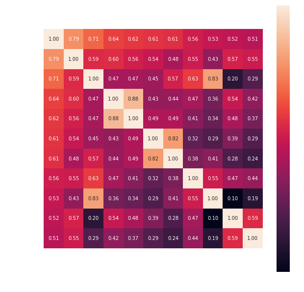
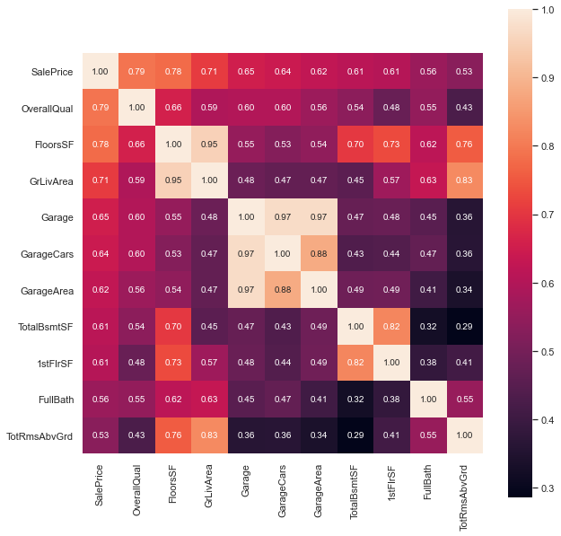
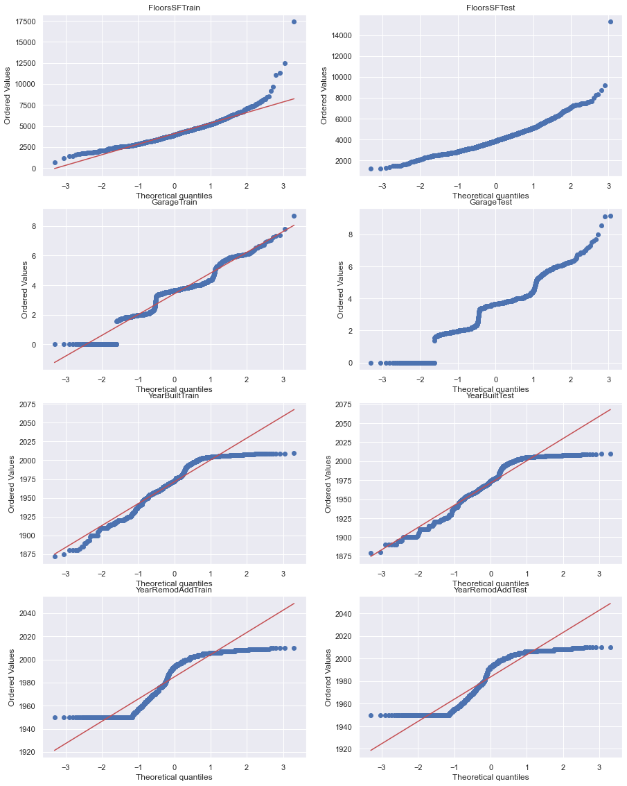
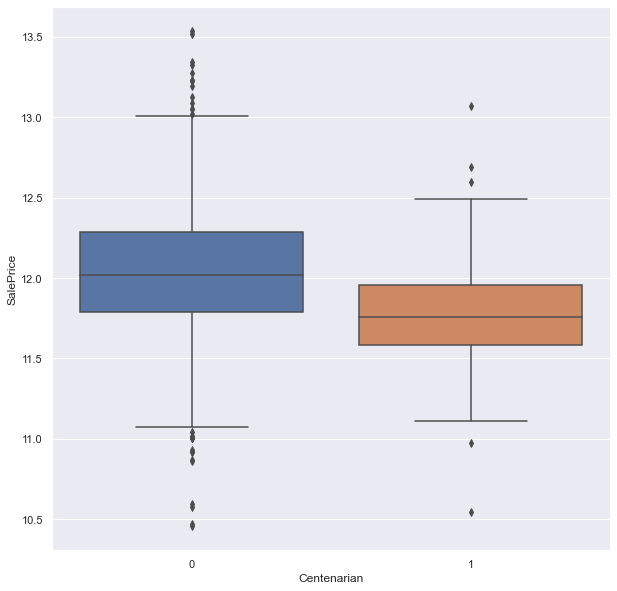
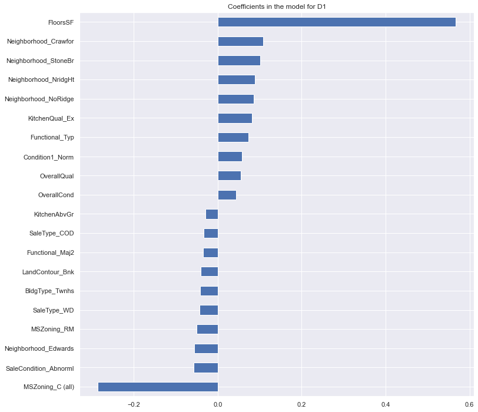
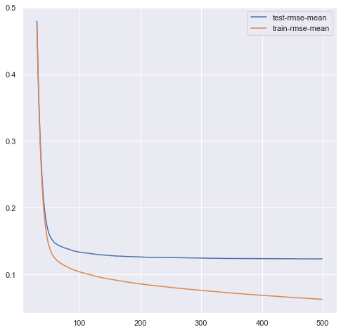

# Regularised_L_M

Created by: <b>Akshay Kumar Gautam</b> 
Domain: <b>Machine Learning</b> 
Project Duration: <b>May-Jun 2021</b> 

## Project Desc:

This project is based on a <a href='https://www.kaggle.com/c/house-prices-advanced-regression-techniques'>kaggle competition</a> held on the latest version of the boston house prices dataset with <b>80 features</b> and a lot of skewness. The goal was to predict house prices in boston based on the dataset with 18 features of different type. The competition was heavily dominated by boosted trees algorithms such as Xgboost and LightGBM as these models perform exceptionally well with tabular data.

There were solutions with linear regression but didn't perform too well. I noticed that people didn't use feature engineering as well and tried to use feature engineering with linear regression to get results that cann compete with boosted trees. With a bit of feature engineering linear regression was performing better but not on par. To deal with this I switched to regularised linear regression, namely Ridge and Lasso regression. I used k-fold cv on the dataset to make the model more robust.
Regularised Linear Regression (RLM) was now performing close to the boosted trees, this presented an option that if done carefully this might surpass boosted trees. The final improvement (and the major one) was creating new feature space with more features with higher correlation with the house prices. This final version of the project performed better than the top submission in the competition (which was Xgboost based) and <b>stayed on top for two weeks</b>.

## Tech Stack Used
| Software     |
| ------------- | 
| Python 3 |
| Pandas |
| Numpy |
| Seaborn |
| Ridge CV |
| Lasso CV |
| ElasticNet |
| XGBoost |

## Result

I was able to achieve a <b>very low RMSE score of 0.122</b> whcih was the lowest at the time in the competition so the project reached leaderboard. 
This project starts with loading a data and then goes to feature engineering. In feature engineering I introduced a new feature space and create new features with higher correlations. Lasso Regression with cross-validation performed best giving us the result we have. 

## Plots from the project

| Plot  | Desc |
| -------- | ------- |
|  | features heat map |
|  | Correlation heat map |
|  | feature distribution |
|  | data distribution |
|  | feature coefficient |
|  | RMSE Plot |
